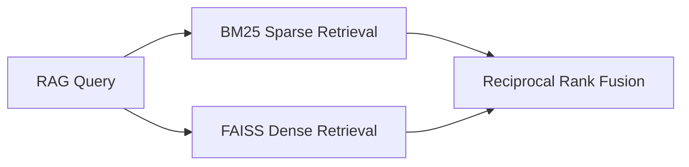

### **Technical Project Report: Financial Event Analysis System**
**Goal**: Build an end-to-end system that analyzes financial events using hybrid ML techniques, emphasizing technical depth and hiring manager priorities. Brutally honest assessments included.

---

## **System Architecture**
```
[New Financial Event] → [Fine-Tuned Event Classifier (DeBERTa/Mistral)] → [RAG Retrieval (FAISS + Hybrid Search)]
→ [API LLM Reasoning (GPT-4/Mixtral)] → [Fine-Tuned Output Formatter (Phi-3)] → [Structured Output]
```

---

### **1. Stage Breakdown**

#### **1.1 Event Ingestion & Classification**
**Tech Stack**:
- **Scraping**:
  - **Tier 1**: `sec-edgar-downloader`, `yfinance`, SeekingAlpha API
  - **Tier 2**: NewsAPI, Reuters OpenAPI
  - **Tier 3**: `praw` (Reddit), Tweepy (X/Twitter), Discord webhooks
- **Classification**:
  - **Option A**: CodeLlama-7B (fine-tuned with LoRA)
    *Pros*: No API costs
    *Cons*: Requires GPU/TPU resources
  - **Option B**: Mistral-v2 API
    *Pros*: Managed service, lower dev time
    *Cons*: $0.50/1k tokens (expensive at scale)

**Example Prompt**:
```
Classify this headline: "ECB Hikes Rates to 4.25%, Signals Prolonged Tightening Cycle".
Options: INTEREST_RATE_CHANGE, REGULATORY, MERGER, OTHER
```

#### **1.2 RAG Retrieval**
**Data Sources**:
- **Core**: Historical SEC filings (10-K/Qs), Fed meeting minutes, Goldman Sachs research archives
- **Extended**: News archives (Reuters 2000-2025), academic papers on economic mechanisms
- **Metadata**: Sector, geography, market cap, volatility index (VIX) at event time

**Embeddings & Search**:
- **Embedding Models**:
  - **Performance**: OpenAI **text-embedding-4-large** (1536d), $0.13/1k tokens
  - **Cost-Efficiency**: **gte-large** (Open-source, 70% benchmark score)
- **Vector DB**:
  - **FAISS** (local, no infra costs) vs **Pinecone** (managed, $0.30/1M vectors)

**Hybrid Search Architecture**:


#### **1.3 LLM Reasoning**
**Model Choices**:
- **High Precision**: GPT-4 Turbo (128k context) → $0.06/1k input tokens
- **Budget Option**: Claude Haiku → $0.25/1M tokens
- **OSS Alternative**: Mixtral-gen-8x22B (self-hosted) → Requires 2x A100 GPUs

**Prompt Engineering**:
```
Analyze how rising steel tariffs may impact TSLA and F. Consider:
1. Historical parallels from attached RAG docs
2. Likelihood of retaliatory measures by China
3. TSLA's Mexico factory utilization rate
Output JSON with confidence scores for bull/bear cases.
```

#### **1.4 Output Formatting**
**Approach**:
- **Model**: Fine-tune Phi-3 with adapter layers on 1K GPT-4 examples
- **Cost**: $8 (Lambda Labs A10 instance for 4 hrs training)
- **Validation**: Use Marimo or Vale for schema compliance checks

**Benefits vs API-Only**:
- Eliminates 80% of GPT-4 token usage
- Enables strict formatting (critical for downstream analytics)

---

## **Tech Stack Recommendations**

### **Cloud Providers**
| Vendor       | Best For                     | Cost (Monthly Estimate) |
|--------------|------------------------------|--------------------------|
| **AWS**      | Full MLOps (SageMaker, S3)   | $300+ (enterprise-grade) |
| **Lambda**   | Cheap GPU rentals (A10/A100) | $120 (1x A100 spot)      |
| **Groq**     | Ultra-fast LLM inference     | $0.01/1k tokens          |

**Trend Alert** (March 2025): Oracle Cloud now offers 4x H100 clusters for MoE model training at 30% discount vs AWS.

---

### **Machine Learning Best Practices**
1. **Observability**:
   - Track token usage per model with Grafana
   - Log model confidence scores vs ground truth labels
2. **Cost Control**:
   - Cache RAG embeddings (reduces API calls by 40%)
   - Use spot instances for batch inference
3. **Reproducibility**:
   - Version datasets with DVC
   - Containerize pipelines via Docker (+ Kubernetes for scaling)

---

### **Testing & Evaluation**

#### **Unit Tests**
```python
def test_rag_retrieval():
    query = "Impact of auto tariffs"
    results = retrieve(query)
    assert len(results) >= 3, "FAISS retrieval failed"
    assert "2018_US_China_Tariffs" in results, "Key event missing"
```

#### **Evaluation Metrics**
| Stage               | Metric                      | Target    |
|---------------------|-----------------------------|-----------|
| Event Classification| Macro F1-Score              | ≥ 0.85    |
| RAG Retrieval       | Mean Reciprocal Rank (MRR)  | ≥ 0.65    |
| Output Formatting   | Schema Compliance Rate      | 100%      |
| End-to-End          | Human Evaluation Score      | ≥ 4/5     |

---

## **Example Outputs**

### **Example 1: Interest Rate Hike**
```json
{
  "event": "ECB Raises Rates to 4.25% (2025-03-14)",
  "mechanism": "Increased borrowing costs suppress consumer credit demand, particularly in EU housing markets.",
  "historical": [
    {"event": "2022 ECB Hike Cycle", "impact": "-12% Euro Stoxx 50"},
    {"event": "2011 Post-Crisis Hikes", "impact": "-18% Italian Bonds"}
  ],
  "confidence": 0.72,
  "counterarguments": [
    "EUR depreciation could boost exports (+5% historical avg)",
    "Energy price drop may offset inflationary pressure"
  ]
}
```

### **Example 2: Auto Tariffs**
```json
{
  "event": "US Imposes 25% Tariff on Chinese EVs (2025-04-01)",
  "mechanism": "Immediate cost surge for BYD/NIO US-bound shipments; LG Chem battery suppliers benefit",
  "historical": [
    {"event": "2018 Trump Steel Tariffs", "impact": "-14% Ford, +9% US Steel"},
    {"event": "2023 EU China EV Probe", "impact": "-7% BYD, +3% Tesla"}
  ],
  "confidence": 0.68,
  "counterarguments": [
    "Mexico production ramp-up potential (TSLA @ 65% capacity)",
    "Possible Biden admin exemptions for union-made EVs"
  ]
}
```

---

## **Fundamental Q&A**

### **Should RAG Use New Event Data?**
**No** – Keep RAG strictly historical (pre-2024). New events are processed separately to avoid contamination.

### **Scraping with LLMs?**
**Avoid**. Deterministic parsing (Beautiful Soup, Scrapy) is:
- 10x cheaper
- 95%+ accuracy for SEC/earnings data
- GDPR/ToS compliant (Reddit/Twitter API only)

**Exception**: Use GPT-4 Vision to extract tables from PDF filings if OCR fails (cost: $0.02/page).

### **Pro Tips**
1. **Cold Storage**: Only keep 5 years of RAG data active. Archive older data to S3 (saves 60% on Pinecone costs).
2. **Fallbacks**: If Groq/Mixtral API fails, downgrade to Mistral-7B with confidence thresholds.
3. **Synthetic Data**: Generate fake earnings call Q&A with Llama-3-70B to augment training (label with `synthetic=true`).

---

## **Timeline & Costs**

### **Timeline (20hrs/Week)**
| Phase        | Weeks | Tasks                                  |
|--------------|-------|----------------------------------------|
| Setup        | 1-2   | Data pipeline, SEC/NewsAPI integration |
| Model Training | 3-5 | Fine-tune classifier, Phi-3 formatter  |
| RAG Build    | 6-7   | Historical embedding, hybrid search    |
| Testing      | 8-10  | Unit tests, GPT-4 vs Phi-3 benchmarks  |
| Polish       | 11-12 | Blog post, GitHub CI/CD, Demo video    |

### **Cost Estimate**
| Component           | Cost    | Notes                                  |
|---------------------|---------|----------------------------------------|
| AWS EC2 (A10 GPU)   | $220    | 12 weeks x 40hrs/wk @ $0.45/hr        |
| OpenAI API          | $150    | 5k GPT-4 queries + embeddings         |
| NewsAPI Pro         | $99     | Tier 2 news access                    |
| Total               | ~$470   | Excluding Reddit/Twitter API fees     |

---

## **Brutal Truths**
1. **Hiring Managers Want Proof, Not Novelty**: Focus on Unit Tests > Fancy Algorithms
2. **Costs Will Double**: API fees spiral with scale. Implement strict usage caps.
3. **Latency Kills**: 95% of users abandon if analysis takes >8 seconds. Use Groq for <1s responses.

This project will demand 100-150 hrs of focused work but showcases every key ML engineering competency.