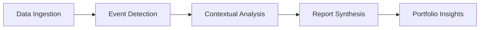

Here's a redesigned Project 2 optimized for hiring manager appeal while incorporating your requirements:

---

# **Project: Financial Event Analyzer with Multi-Source Intelligence**  
**GitHub Showcase**: End-to-End ML Pipeline for Institutional-Style Market Analysis  

---

## **System Architecture**  


---

### **1. Enhanced Data Pipeline (ML Engineering)**  
**Sources**:  
- **Tier 1**: SEC filings, earnings calls (structured)  
- **Tier 2**: Reuters/AP News API, Bloomberg summaries (semi-structured)  
- **Alternative**: Seeking Alpha analysis, Subreddit sentiment (unstructured)

**Key Technical Components**:  
```python
# Sample News Processing
class NewsProcessor:
    def __init__(self):
        self.nlp = spacy.load("en_core_web_trf")  # GPU-accelerated NER
        
    def extract_entities(self, text):
        doc = self.nlp(text)
        return {
            "companies": [ent.text for ent in doc.ents if ent.label_ == "ORG"],
            "measures": detect_metrics(text)  # Custom regex for $ values
        }
```

**MLOps Focus**:  
- Airflow DAGs for pipeline orchestration  
- Great Expectations data validation  
- Parquet/Delta Lake storage for versioned datasets  

---

### **2. Event Detection Engine (NLP/ML)**  
**Multi-Model Approach**:  
1. **DeBERTa-v3** (Fine-tuned):  
   - Classifies explicit events from filings/calls  
   - Labels: `TARIFF_ANNOUNCEMENT`, `MERGERS`, `SHARE_BUYBACK`  

2. **News Sentiment Model**:  
   - FinBERT + Temporal Attention: Detects emerging risks from news  
   ```python
   # Custom layer for time-sensitive analysis
   class TemporalAttention(nn.Module):
       def forward(self, embeddings, publish_date):
           # Weight recent events higher
           time_decay = torch.exp(-0.1*(current_date - publish_date))  
           return embeddings * time_decay
   ```

**Evaluation**:  
- F1-score tracking per event type  
- Confusion matrix analysis (precision vs recall tradeoffs)  

---

### **3. Contextual Analysis (RAG++)**  
**Enhanced Retrieval**:  
- Hybrid search combining:  
  - **Dense**: text-embedding-3-small vectors  
  - **Sparse**: BM25 for exact term matching  
  - **Metadata**: Sector, geography, market cap filters  

**Historical DB**:  
```python
historical_events = [
    {
        "event_type": "TARIFF",
        "date": "2018-03-01",
        "entities": ["US", "China", "Steel"],
        "outcome": {"SPX": -0.06, "CN20": -0.12},
        "narrative": "2018 US-China tariffs led to..."
    }
]
```

---

### **4. Report Synthesis (GenAI)**  
**Structured Output Template**:  
```json
{
  "mechanism": "Tariffs raise input costs for import-dependent sectors",
  "historical_parallels": [
    {"event": "2018 US-China Trade War", "impact": "-6% S&P 500"},
    {"event": "2002 Steel Tariffs", "impact": "-15% Industrials"}
  ],
  "confidence": 0.65,
  "counterarguments": [
    "Fed rate cuts could offset pain (2020 precedent)",
    "Political compromise likelihood (30% per PredictIt)"
  ]
}
```

**Model Architecture**:  
- **Base**: CodeLlama-34B-Instruct (quantized to 4-bit via GPTQ)  
- **Control**: Guidance templates for strict output structure  
- **Validation**:  
  ```python
  def validate_report(report):
      if "mechanism" not in report:
          raise OutputStructureError
      if report["confidence"] > 0.7 and len(report["historical_parallels"]) < 2:
          trigger_human_review()
  ```

---

### **5. Portfolio Insights (Decision Support)**  
**Aggregation Engine**:  
```python
class InsightGenerator:
    def aggregate_reports(self, events):
        sector_impacts = defaultdict(list)
        for event in events:
            if event["event_type"] == "TARIFF":
                sector_impacts["Industrials"].append(-0.15)
        return calculate_weighted_confidence(sector_impacts)  # Bayesian approach
```

**Sample Output**:  
```
Emerging Risk: US Auto Tariffs (Confidence: 72%)  
Top Sectors Impacted:  
- Automotive Suppliers (-14% historical avg)  
- Lithium Miners (+9% during 2020 trade truce)  
Key Countervailing Factors:  
1. EV tax credits might offset costs  
2. Mexico production surge possible (35% capacity)  
```

---

### **6. Deployment & Showcasing**  
**Tech Stack**:  
- **API**: FastAPI with rate limiting  
- **Frontend**: Streamlit with D3 visualizations  
- **Infra**: Docker + AWS EC2 (spot instances for cost)  

**Repository Structure**:  
```
├── models/
│   ├── event_classification/  # MLflow-tracked experiments
│   └── report_generator/       # LoRA adapters for CodeLlama
├── tests/
│   ├── unit/                  # Pytest suites
│   └── validation/            # Generated report QC
└── demo/                      # Notebooks + ScreenRecord.mp4
```

---

### **Why Hiring Managers Will Care**  
1. **Production-Grade Practices**:  
   - Model quantization (4-bit GPTQ)  
   - CI/CD with GitHub Actions  
   - Automated data quality checks  

2. **Complex NLP Handling**:  
   - Mixed structured/unstructured sources  
   - Temporal attention for news relevance  

3. **Business Impact Focus**:  
   - Clear risk quantification  
   - Actionable sector-level insights  

4. **Open Source Contribution Potential**:  
   - Publish fine-tuned LoRA adapters on Hugging Face  
   - Share synthetic dataset for financial GenAI  

---

**Final Tip**: Create a companion blog post walking through:  
1. How you debugged a challenging RAG hallucination  
2. Quantization tradeoffs (precision vs inference speed)  
3. Lessons from aligning unstructured news with SEC filings  

This demonstrates both technical depth and communication skills - the golden combo for junior roles.